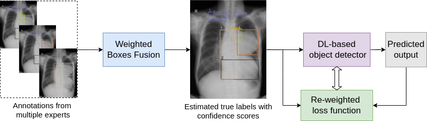

# Learning from Multiple Expert Annotators for Enhancing Anomaly Detection in Medical Image Analysis

[](https://www.gnu.org/licenses/gpl-3.0.en.html)


## Overview

This repository contains a PyTorch implementation of the Learning from Multiple Expert Annotators for Enhancing Anomaly Detection in Medical Image Analysis, submitted in Neurocomputing journal. The arXiv paper will be coming soon.

The overall architecture is about how to efficiently learn from annotations given by multiple radiologists. We firstly use **Weighted Boxes Fusion** to estimate the hidden ground truth with confidence scores. The estimated annotations and their scores are then used to train a deep learning object detector with a re-weighted loss function to localize
abnormal findings.   

## Installation

Run ```pip install -r requirements.txt``` to install all the dependencies.

## Structure

* `ckps_det/` - Checkpoints for trained models.
* `data/` - Data folder. Contains the annotations for both simulated and the real-world **VinDr-CXR** datasets
* `source_det/` - Source code folder.
  * `yolov5/` - YOLOv5 source code from [ultralytics](https://github.com/ultralytics/yolov5).
  * `yolov5wl/` - YOLOv5 implemented with Experts Agreement Re-weighted Loss (EARL).
* `README.md` - This manual.
* `LICENSE` - GNU General Public License v3.0.
* `requirements.txt` - Required Python packages.

## Usage

### Data Preparation
The datasets should be organized similar to 
`https://github.com/huyhieupham/learning-from-multiple-annotators/tree/main/data/VinCXR/labels_det`.

### Training
Follow the official [YOLOv5](https://github.com/ultralytics/yolov5) repo.

## Feedback

For questions and comments, feel free to contact [Hieu Pham](mailto:hieuhuy01@gmail.com).

## Acknowledgment
This work was supported by Smart Health Center at [VinBigData JSC](https://vinbigdata.org/). The [VinDr-CXR](https://vindr.ai/datasets/cxr) and many other publicly open datasets and computer aided diagnosis (CAD) systems can be found at [VinDr](https://vindr.ai/).    

Thanks to [Glenn Jocher](https://github.com/glenn-jocher) for [his awesome YOLOv5 codebase](https://github.com/ultralytics/yolov5).

Thanks to **Solovyev et. al.** for their [Weighted Boxes Fusion paper](https://arxiv.org/abs/1910.13302) and [implementation code](https://github.com/ZFTurbo/Weighted-Boxes-Fusion).

Thanks to [Ross Wightman](https://github.com/rwightman) for [his implementation](https://github.com/rwightman/efficientdet-pytorch) of [EfficientDet](https://openaccess.thecvf.com/content_CVPR_2020/html/Tan_EfficientDet_Scalable_and_Efficient_Object_Detection_CVPR_2020_paper.html).

# Citing
If you use our code in this repo for your research, please use the following BibTeX for citation:

```
BibTeX goes here

```
